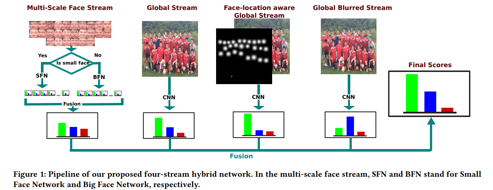

## Group-Level Emotion Recognition using Deep Models with A four-stream Hybrid Network



This repository contains code for our paper at ICMI 18, as a  part of [Emotiw18](https://sites.google.com/view/emotiw2018) challenge. Our propoosed method secured __3rd__ position in the sub-challenge. For a detailed understanding of the proposed method consider reading our [paper](https://dl.acm.org/citation.cfm?id=3264987). If you think this repository or our paper was helpful consider citing it.

```
@inproceedings{khan2018group,
  title={Group-Level Emotion Recognition using Deep Models with A Four-stream Hybrid Network},
  author={Khan, Ahmed Shehab and Li, Zhiyuan and Cai, Jie and Meng, Zibo and O'Reilly, James and Tong, Yan},
  booktitle={Proceedings of the 2018 on International Conference on Multimodal Interaction},
  pages={623--629},
  year={2018},
  organization={ACM}
}
```
## Menu
1. [Before you start](#Before-you-start)
2. [Running Code](#Running-code)
    1. [Preprocessing](#Preprocessing)
    2. [Training](#Training)
    3. [Evaluation](#Evaluation)
    4. [Prepare Output](#Prepare-Output)


## Before you start

__Clone Repository:__ Clone this repository with the follwing command. Submodule is necessary as it contains the [MTCNN code](https://github.com/TropComplique/mtcnn-pytorch) as submodule.
```bash
git clone --recurse-submodules https://github.com/shehabk/icmi18_group_level.git
```
__EmotiW18 Dataset:__ Collect the dataset from the organizers, and put it inside the **data** folder. The name of this subfolder should be 'OneDrive-2018-03-20' which contains 'Test_Images', 'Train', and 'Validation'.

__Pretrained Models:__ The Multi-Scale faces stream of our proposed method is pretrained on RAF-DB and FER3013 datasets. I have shared the pretrained models [here](https://drive.google.com/file/d/14jaoYPajmrld-_VnwbXl46QthJroGbcQ/view?usp=sharing). Download the pretrained models and keep them in models directory.

__Folder Strucure:__ Make sure to put the downloaded files in the folloing folder structure.


```bash
project_root/    
    |--data/
        |--OneDrive-2018-03-20           
            |--Train
                |--           
            |--Validation
                |--
            |--Test_Images
                |--
        |--****            
    |--models/
        |--pretrained
            |--raf_fer2013
                |--****
    |--scripts/
    |--src/
    |--images/
    |README.md
    
``` 

## Running code

#### Preprocessing

Make sure the data and pretrained models are placed in appropriate location. __cd__ into the project root and run the preprocessing script.

```bash
bash scripts/preprocessing/preprocess.sh
```

It will do all the preprocessing steps, which includes getting landmarks, cropping and aligning face images, creating images for heatmap and blurred stream. It will also generate necessary image lists to be used for the training stream.


#### Training

Make sure you have run the preprocessing step properly. Run the following scripts from project root. 

```bash
# training on the training set.
# choose best model from validation set.
bash scripts/training/train_on_train.sh

# training on the training+validation set
# choose last model for testing.
bash scripts/training/train_on_train_val.sh
```

#### Evaluation

Make sure the training step is completed. This step depends on the previous two step, and will require all the trained models. Run the following scripts from the project_root.

```
# Use models trained on training set
# Evaluate the validation set.
bash scripts/evaluation/evaluate_train.sh

# Use the models trained on training+validation sets
# Evaluated on the test set.
bash scripts/evaluation/evaluate_train_val.sh
```

#### Prepare Output

This script will prepare the test set in the format of the organizers. But you __need to modify the weights in this file__. This file is kept commented, uncomment it and adjust the weights.

```bash
bash scripts/evaluation/prepare_submission.sh 
```


